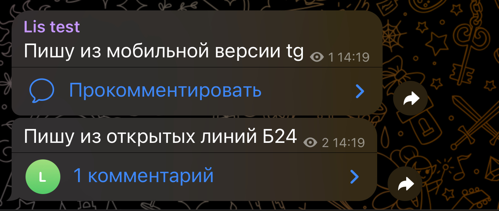
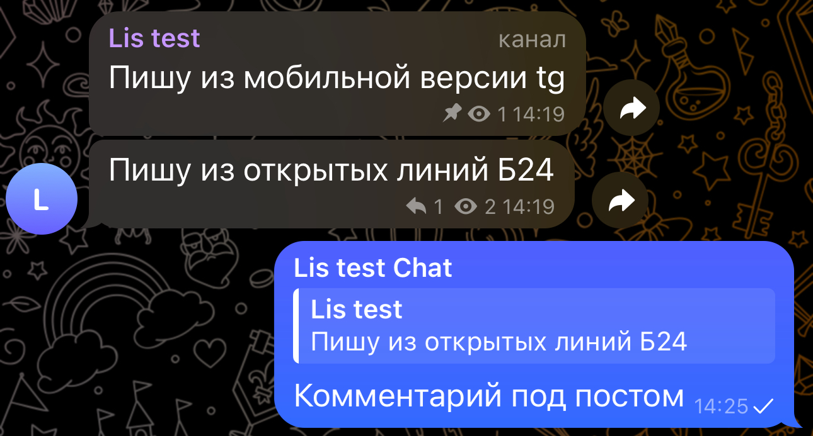

# Подключение канала

Чтобы подключить канал Телеграм к Открытым линиям Битрикс24, выполните следующие действия:



#### Создайте канал в мобильной или web-версии Телеграм.

* В мобильной версии откройте вкладку Чаты —> над списком чатов выберите  —> далее    "Создать канал".&#x20;
* В web-версии нажмите  в нижней части списка чатов, далее "Создать канал".&#x20;

1. Укажите название канала, при необходимости добавьте описание и установите аватар.&#x20;
2. Выберите тип канала: "Публичный" — данный тип канала найдётся через поиск Телеграм, а также вся информация в таком канале будет доступна пользователям, в том числе неподписанным на канал; "Частный" канал нельзя найти через глобальный поиск Телеграм, а информация в нём будет доступна только подписчикам.&#x20;
3. Сформируйте ссылку на канал, а также установите параметры сохранения и копирования материалов (ползунок "Запретить копирование"). Это необязательный шаг, вернуться к нему можно будет позже через Настройки канала.
4. Добавьте первых подписчиков канала на следующем этапе и нажмите "Далее".
5. Создание канала завершено.



#### Создайте чат канала, если необходимо включить функцию комментирования постов.&#x20;

Без чата, прикреплённого к каналу, подписчики не смогут оставлять комментарии, а также начинать обсуждения.

В настройках канала выберите пункт "Обсуждение" — "Добавить" — "+ Создать группу". По умолчанию название чата формируется в виде: <mark style="color:$success;">Название канала</mark> <mark style="color:green;">Chat</mark>. При необходимости настройте автоудаление сообщений, затем нажмите "Создать".



#### Откройте приложение OLChat Telegram, выберите линию, к которой подключен аккаунт с созданным каналом, и перейдите в настройки групп данной линии.

<figure><figcaption></figcaption></figure>


В случае, если канал создан на одном аккаунте Телеграм (например, на личном), а к приложению OLChat Telegram подключен другой (например, рабочий), добавьте в канал аккаунт OLChat и выдайте ему следующие права администратора на управление сообщениями. В противном случае сообщения из открытых линий отправляться в канал не будут.




#### Настройте режим работы на создание чатов в открытых линиях (1), включите отправку сообщений (2).

<figure><figcaption></figcaption></figure>


Недавно созданный канал может появиться в списке групп не сразу, а через некоторое время. Обычно это занимает до 15 минут.




#### Воспользуйтесь кнопкой "Открыть чат" (3) напротив канала или группы, чтобы начать диалог в открытой линии Битрикс24.

Используйте открытую линию канала, чтобы публиковать посты через Битрикс24, а открытую линию чата для работы с комментариями и обсуждениями.



#### Подключение канала к OLChat Telegram завершено.



В открытой линии Битрикс24, привязанной к **каналу**, сообщения будут выглядеть следующим образом:

<figure><figcaption></figcaption></figure>

Вид из мобильной версии Телеграм:

<figure><figcaption></figcaption></figure>

В открытой линии Битрикс24, привязанной к **обсуждениям** канала, сообщения будут выглядеть следующим образом:

<figure><figcaption></figcaption></figure>

Вид из мобильной версии Телеграм:

<figure><figcaption></figcaption></figure>
