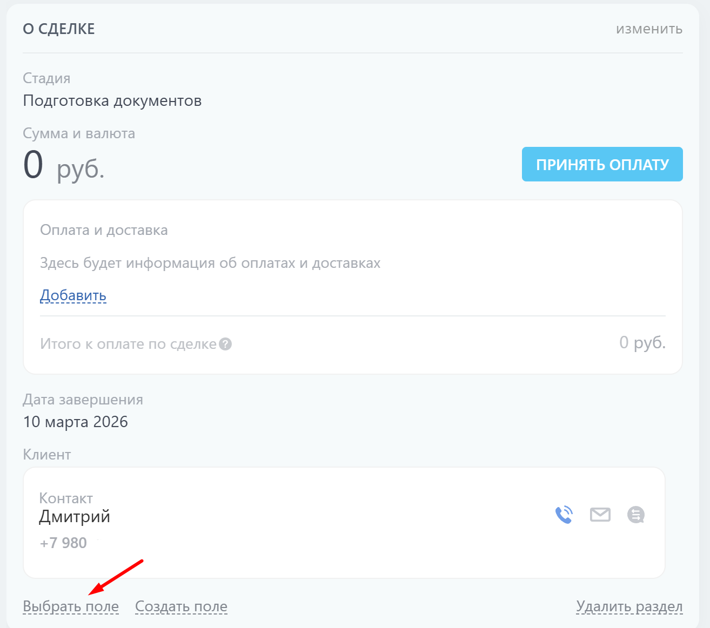
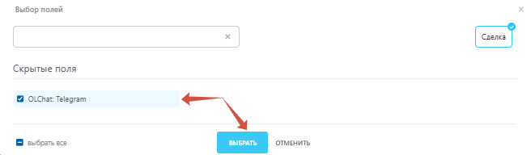
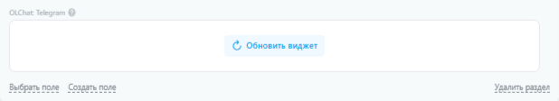
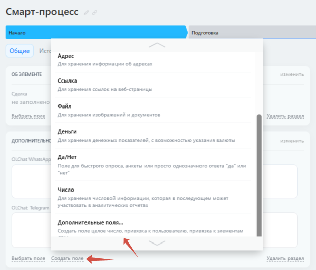
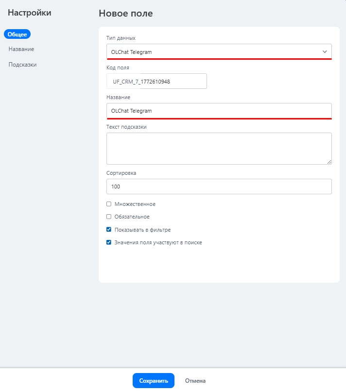
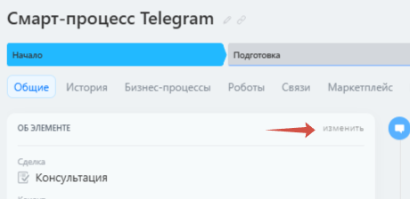

# Copy of Виджеты в карточках CRM и Смарт-процессах

## **Виджет Олчат: Telegram**

Виджет обеспечивает быстрый доступ из карточки любой сущности CRM (системы управления взаимоотношениями с клиентами) к выбору линии, созданию нового чата, переходу в уже созданный чат, переписки, а также позволяет отправить сообщение клиенту прямо из карточки CRM, не переходя в основное приложение.

### Как включить виджет&#x20;


Сначала нужно активировать виджет в настройках приложения.


1.  Перейдите в **настройки приложения** в правом верхнем угл&#x443;**.** 

    <figure><figcaption></figcaption></figure>
2. Найдите раздел **Опции приложения**.
3.  Включите параметр **«Виджет Олчат Telegram в карточке CRM».**

    <figure><figcaption></figcaption></figure>

Отключение виджета производится путём снятия галочки.

### **Как показать виджет Олчат: Telegram в карточке CRM**

Чтобы показать виджет в карточке CRM, зайдите в неё и нажмите на кнопку **Выбрать поле**.

<figure><figcaption></figcaption></figure>

В открывшемся списке полей установите галочку напротив «Олчат: Telegram» и нажмите на кнопку **Выбрать**.

<figure><figcaption></figcaption></figure>

Нажмите на кнопку **Обновить виджет**. Виджет будет готов к работе.

<figure><figcaption></figcaption></figure>

### **Как показать виджет Олчат Telegram в карточке Смарт-процесса**

Чтобы показать виджет в карточке Смарт-процесса, выполните следующие действия.

* В карточке Смарт-процесса создайте пользовательское поле с типом Олчат: Telegram. Для этого нажмите на кнопку **Создать поле** — **Дополнительные поля...**

<figure><figcaption></figcaption></figure>

* В выпадающем списке «Тип данных» выберите тип Олчат Telegram. В поле «Название» укажите название поля и нажмите на кнопку **СОХРАНИТЬ**.

<figure><figcaption></figcaption></figure>

* Войдите в режим редактирования карточки и установите виджет. Для входа в режим редактирования карточки нажмите на кнопку **Изменить**.

<figure><figcaption></figcaption></figure>


Нажатие на иконку «Обновить данные виджета» очищает данные поля виджета. Обновление данных можно использовать в том случае, если вы столкнулись с некорректным отображением идентификаторов клиента (номеров телефонов или username) в виджете. Например, добавили клиента с Telegram-аккаунтом в карточку, но в виджете он не появился.


Подробнее о работе с приложением в карточке ознакомьтесь в статье [«Отправка сообщений из приложения в карточке»](https://tg.docs.olchat.io/ispolzovanie/kak-napisat-pervym-cherez-prilozhenie-olchat-v-kartochke).
