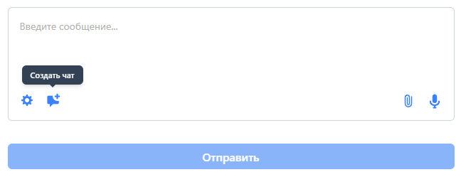
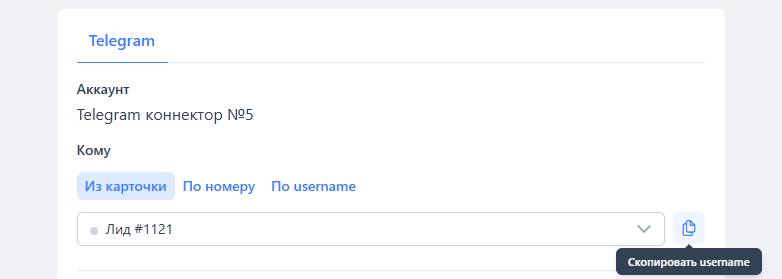
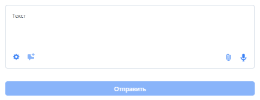
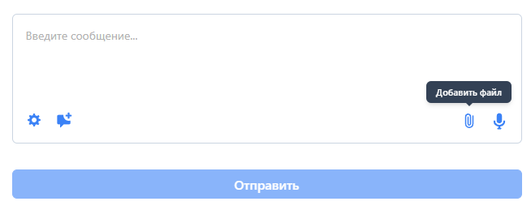
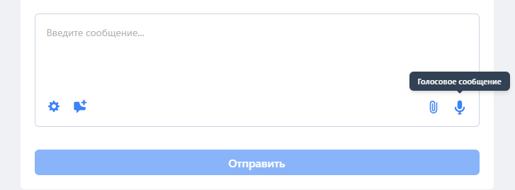
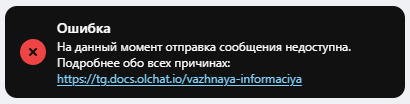

# Copy of Отправка сообщений из приложения в карточке

Для того чтобы написать сообщение клиенту, воспользуйтесь приложением **\[Олчат] Telegram** в карточке:

<figure><figcaption></figcaption></figure>


Если вы отправляете сообщение через приложение в первый раз после подключения интеграции, приложение может открываться не сразу, а спустя некоторое время. Во время открытия приложения вы увидите уведомление «Идёт загрузка приложения \[Олчат] Telegram». Связано это с синхронизацией ваших контактов Telegram с системой. Рекомендуем перезайти в приложение через 3-5 минут.


<figure><figcaption></figcaption></figure>

### Откуда

При отправке можно выбрать коннектор, через который вы отправляете сообщение.

### Кому

В выпадающем списке указаны все найденные аккаунты Telegram. Поиск аккаунтов производится в полях **Телефон, Мессенджер** и **Сайт** в лиде или привязанной к сделке сущности (в контакте, в компании). Написать человеку можно по номеру или username (по имени пользователя).

Подробнее о том, как правильно записывать контактные данные клиента в карточку CRM (системы управления взаимоотношениями с клиентами), описано в статье [osobennosti-zapisi-kontaktnykh-dannykh-klienta-v-kartochke-crm.md](osobennosti-zapisi-kontaktnykh-dannykh-klienta-v-kartochke-crm.md "mention").

<figure><figcaption></figcaption></figure>

Если вы хотите создать чат открытой линии и пригласить туда сотрудников портала для общения с клиентом, нажмите на кнопку «СОЗДАТЬ ЧАТ».

<figure><figcaption></figcaption></figure>

Также вы можете скопировать имя пользователя (username) клиента в Telegram, нажав на соответствующую кнопку.

<figure><figcaption></figcaption></figure>

### Отправка сообщений

**СООБЩЕНИЕ** — здесь нужно указать текст, который вы хотите отправить.

<figure><figcaption></figcaption></figure>

**ФАЙЛЫ** — для прикрепления файла выберите его на компьютере. При необходимости активируйте галочку «Отправить как документ» для отправки файла без сжатия.

<figure><figcaption></figcaption></figure>

**ГОЛОСОВОЕ** — есть возможность записать и отправить голосовое сообщение. Для этого необходимо нажать на значок микрофона. После записи сообщение можно прослушать и при необходимости удалить.

<figure><figcaption></figcaption></figure>

**Способ публикации в открытой линии**:

* **Входящее.**
* **Без публикации.**
* **Исходящее.**

Если выбран тот или иной способ публикации в чате открытой линии и чат не был создан до этого, то он будет создан после публикации сообщения.

<figure><figcaption></figcaption></figure>


Ранее Открытые линии не позволяли писать клиенту первыми. Чтобы реализовать эту возможность, первое сообщение было как бы от лица клиента, и Битрикс24 думал, что это входящее сообщение.


При выборе способа **Входящее** сообщение будет опубликовано в чате как будто от лица клиента, но с пометкой «Олчат», показывающей, что это сообщение было написано методом публикации **Входящее.**

<figure><figcaption></figcaption></figure>

При выборе способа **Исходящее** сообщение будет опубликовано в Открытой линии как исходящее от того сотрудника, который выполнил отправку из карточки сообщения. Это новая возможность Открытых линий.

<figure><figcaption></figcaption></figure>

При выборе режима **Без публикаци** сообщение не будет опубликовано в чате Открытой линии.

**Создавать Дело в таймлайне** — если галочка установлена, то для отправленного сообщения будет создано дело со статусами доставки в таймлайне карточки сущности.

<figure><figcaption></figcaption></figure>

<figure><figcaption></figcaption></figure>

<figure><figcaption></figcaption></figure>

### Особенности настроек конфиденциальности номера в Telegram

Иногда при попытке отправить клиенту сообщение может появиться ошибка: «На данный момент отправка сообщения
&#x20;недоступна. Подробнее обо всех причинах:
&#x20;https://tg.docs.olchat.io/vazhnaya-informaciya».

<figure><figcaption></figcaption></figure>

**Это уведомление может возникать по одной из следующих причин:**

* у клиента [отсутствует аккаунт](https://tg.docs.olchat.io/vazhnaya-informaciya#net-akkaunta) Telegram;
* номер телефона скрыт в [настройках конфиденциальности](https://tg.docs.olchat.io/vazhnaya-informaciya#nastroiki-konfidencialnosti) Telegram;
* аккаунт заблокирован;
* первый контакт;
* превышены [лимиты](https://tg.docs.olchat.io/vazhnaya-informaciya#limity).

#### **Что делать**

Когда вы пишете клиенту впервые, подождите около **5 минут** — за это время информация может прогрузиться — и затем повторите отправку сообщения.

Если после ожидания уведомление продолжает отображаться, это означает, что номер телефона скрыт настройками конфиденциальности на стороне клиента (либо у клиента действительно нет Telegram-аккаунта).

Если в разделе «Кто видит мой номер телефона?» выбран вариант «Никто» а в разделе – «Кто может найти меня по номеру?» вариант «Контакты» — вы увидите сообщение как на примере выше. Получить username и отправить на него сообщение, если вы не будете сохранены у клиента как контакт в его телефонной книге, не получится.
