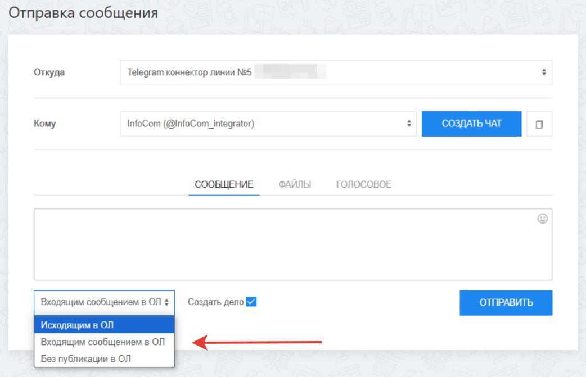

# Отправка сообщений из приложения в карточке

Для того чтобы написать сообщение клиенту, воспользуйтесь приложением **\[OLChat] Telegram** в карточке:

<figure><figcaption></figcaption></figure>

<figure><figcaption></figcaption></figure>


В настоящее время **Публикация в чате открытой линии** возможно только **Входящим сообщением!** Публикация **Исходящим в ОЛ** недоступна. Техотдел работает над добавлением такой возможности.



Если вы отправляете сообщение через приложение в первый раз после подключения интеграции, приложение может открываться не сразу, а спустя некоторое время. Во время открытия приложения вы увидите уведомление «Идёт загрузка приложения \[OLChat] Telegram». Связано это с синхронизацией ваших контактов Telegram с нашей системой. Рекомендуем перезайти в приложение через 3-5 минут.


<figure><figcaption></figcaption></figure>

### Откуда

При отправке можно выбрать коннектор, через который вы отправляете сообщение.

### Кому

В выпадающем списке указаны все найденные аккаунты Telegram. Поиск аккаунтов производится в полях **Телефон, Мессенджер** и **Сайт** в лиде или привязанной к сделке сущности (контакте, компании). Подробнее о том, как правильно записывать контактные данные клиента в карточку CRM описано в статье [osobennosti-zapisi-kontaktnykh-dannykh-klienta-v-kartochke-crm.md](osobennosti-zapisi-kontaktnykh-dannykh-klienta-v-kartochke-crm.md "mention").

Если вы хотите создать чат открытой линии и пригласить туда сотрудников портала для общения с клиентом — нажмите на кнопку «СОЗДАТЬ ЧАТ».

Кроме этого, вы можете скопировать username клиента в Telegram нажав на соответствующую кнопку.

<figure><figcaption></figcaption></figure>

### Отправка сообщений

**СООБЩЕНИЕ** — тут можете писать текст. Если нужны эмодзи, воспользуйтесь меню в правом верхнем углу.

<figure><figcaption></figcaption></figure>

**ФАЙЛЫ** — для прикрепления файла выберите файл на компьютере. При необходимости активируйте галочку «Отправить как документ» для отправки файла без сжатия.

<figure><figcaption></figcaption></figure>

**ГОЛОСОВОЕ** — есть возможность записать и отправить голосовое сообщение. Для этого необходимо нажать на значок микрофона. После записи сообщение можно прослушать и при необходимости удалить.

<figure><figcaption></figcaption></figure>

**Способ публикации в открытой линии —** доступны варианты: **Исходящим в ОЛ, Входящим сообщением в ОЛ** и **Без публикации в ОЛ.** Если выбран тот или иной способ публикации в чате открытой линии и чат не был создан до этого, то он будет создан после публикации сообщения.

Ранее Открытые линии не позволяли писать клиенту первыми. Для того, чтобы реализовать эту возможность, мы писали первое сообщение как бы от лица клиента, и Битрикс24 думал, что это входящее сообщение. При выборе способа **Входящим сообщением в ОЛ,** сообщение будет опубликовано в чате как будто бы от лица клиента, но с пометкой «OLChat», показывающей, что это сообщение было написано методом публикации **Входящим сообщением в ОЛ.**

<figure><figcaption></figcaption></figure>

При выборе способа **Исходящим в ОЛ,** сообщение будет опубликовано в Открытой линии как исходящее от того сотрудника, который выполнил отправку из карточки сообщения. Это новая возможность Открытых линий.

<figure><figcaption></figcaption></figure>

При выборе способа **Без публикации в ОЛ** сообщение не будет опубликовано в чате Открытой линии.

**Создать дело** — если галочка установлена, то для отправленного сообщения будет создано дело со статусами доставки в таймлайне карточки сущности.

<figure><figcaption></figcaption></figure>

<figure><figcaption></figcaption></figure>

<figure><figcaption></figcaption></figure>

### Особенности настроек конфиденциальности номера в Telegram

Иногда при попытке отправить клиенту сообщение через приложение, вы можете увидеть сообщение:

<figure><figcaption></figcaption></figure>

Связано это может быть или с тем, что у клиента действительно нет аккаунта Telegram, или с настройками конфиденциальности номера телефона.

Если в разделе «Кто видит мой номер телефона?» выбран вариант «Никто» а в разделе – «Кто может найти меня по номеру?» вариант «Контакты» — вы увидите сообщение как на примере выше. Мы не сможем получить username и отправить на него сообщение, если вы не будете сохранены у клиента как контакт в его телефонной книге.

<figure><figcaption></figcaption></figure>

Если в разделе «Кто видит мой номер телефона?» выбраны варианты «Все» или «Контакты» – мы сможем получить username и отправить на него сообщение.

<figure><figcaption></figcaption></figure>

