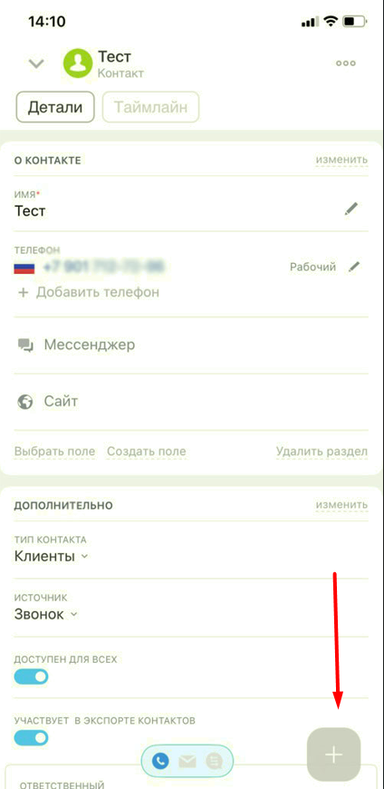
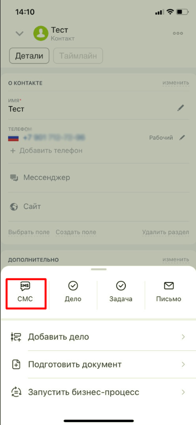
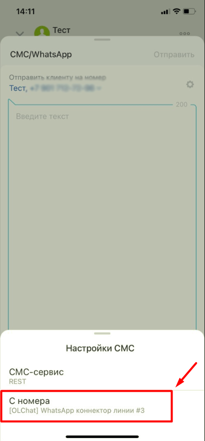
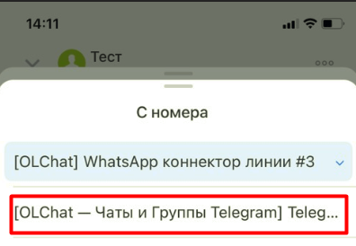

# Отправка сообщений из мобильного приложения Битрикс24

Если вы работаете с мобильным приложением Битрикс24, то вы так же имеете возможность писать сообщения первыми клиентам.

Необходимо перейти в сущность CRM (Лид, Контакт, Сделка), из которой вы планируете отправить сообщение и нажать на "+".

<figure><figcaption></figcaption></figure>

Затем необходимо выбрать функционал "SMS".

<figure><figcaption></figcaption></figure>

Затем в новом окне выбрать провайдера, через которое будет отправлено сообщение.&#x20;

<figure><figcaption></figcaption></figure>

После этого выбрать необходимое приложение, если у вас их установлено несколько.&#x20;

<figure><figcaption></figcaption></figure>

Введите текст сообщения в поле и отправьте.&#x20;
