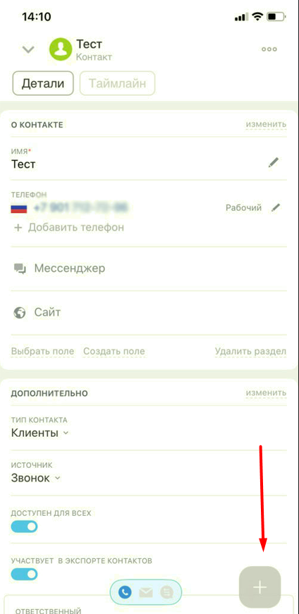
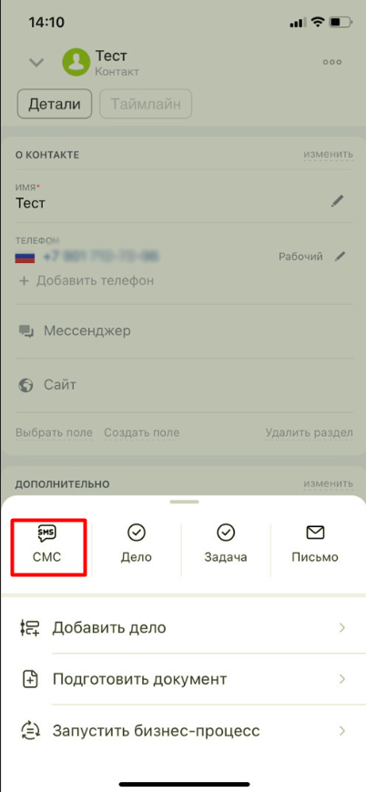
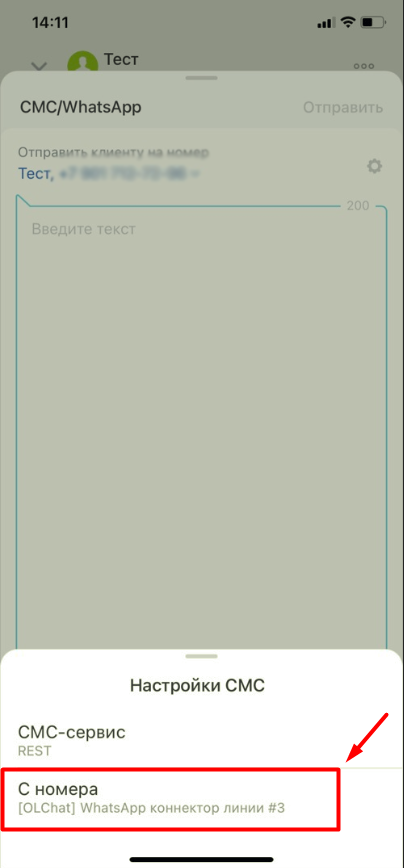
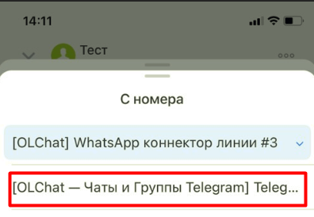

# Отправка сообщений из мобильного приложения Битрикс24

Если вы работаете с мобильным приложением Битрикс24, то вы также имеете возможность первым написать клиенту.

Необходимо перейти в сущность CRM (системы управления взаимоотношениями с клиентами), из которой вы планируете отправить сообщение, например, в сделку, и нажать на «+».

<figure><figcaption></figcaption></figure>

Затем необходимо выбрать функционал «СМС».

<figure><figcaption></figcaption></figure>

Затем в новом окне выбрать провайдера, через которого будет отправлено сообщение.

<figure><figcaption></figcaption></figure>

После этого выбрать необходимое приложение, если у вас их установлено несколько.

<figure><figcaption></figcaption></figure>

Введите текст сообщения в поле и отправьте.
