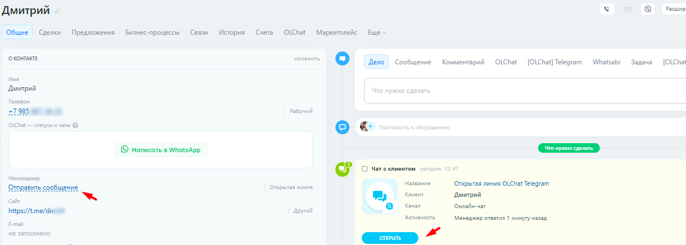

# Получение и отправка сообщений

Общение с клиентом происходит через стандартный функционал[ открытых линий Битрикс24](https://www.bitrix24.ru/features/olines.php).

Когда клиент пишет вам в Telegram, создаётся чат в Открытой линии в Контакт-центре, в котором и ведётся дальнейшее общение.

### Работа с сообщениями

Вы можете использовать все возможности открытых линий, такие как: приветственное сообщение, очередь операторов, оценка качества и другие. Для настройки возможностей воспользуйтесь данной [ссылкой](https://helpdesk.bitrix24.ru/open/2448369/).

Чтобы продолжить общение с клиентом, достаточно нажать на иконку чата в карточке контакта, лида или сделки, или нажать на кнопку «ОТКРЫТЬ».

<figure><figcaption></figcaption></figure>

### Отправка файлов через открытую линию

Чтобы отправить клиенту файл с помощью открытых линий, в чате открытой линии нажмите на , затем  выберите необходимый файл с устройства или из Битрикс.Диска.

<figure><figcaption></figcaption></figure>


В случае, если вес отправляемого файла превышает 400 Мб, такой файл будет отправлен клиенту в виде короткой ссылки.



В случае, когда клиент отправляет вам файл, вес которого превышает 400 Мб, такое сообщение не будет доставлено в открытую линию, несмотря на успешный статус отправки у клиента.


В открытых линиях сообщения с файлами выглядят следующим образом:

<figure><figcaption></figcaption></figure>

У клиента в Telegram сообщения выглядят так:

<figure><figcaption></figcaption></figure>


Ссылка будет неактивной (некликабельной) в случае, если аккаунт вашей компании не добавлен клиентом в контакты.

