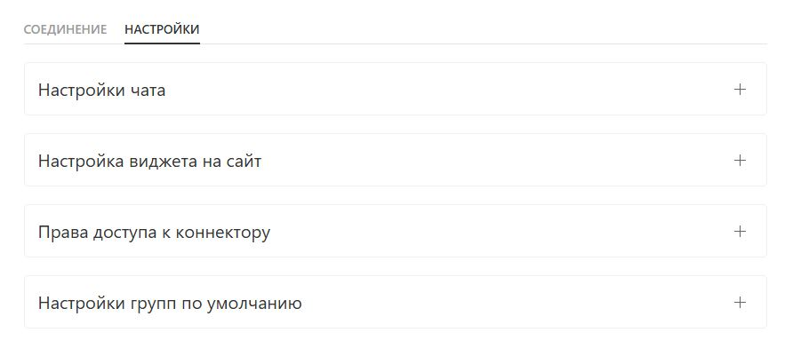
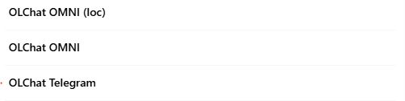
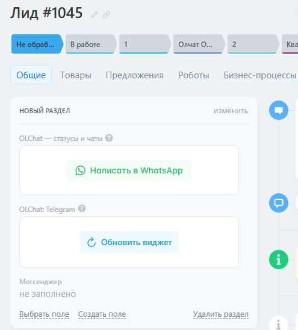
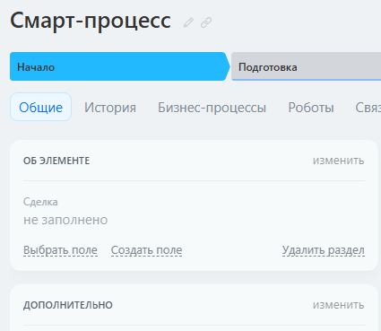

# Виджеты в карточках CRM и Смарт-процессах

## **Виджет «OLChat Telegram»**&#x20;

Виджет «OLChat Telegram» обеспечивает быстрый доступ из карточки любой сущности CRM к выбору линии, созданию нового чата, переходу в уже созданный чат, просмотру истории переписки, а также позволяет отправить сообщение клиенту прямо из карточки CRM, не переходя в основное приложение.

#### **Как включить и выключить виджеты**&#x20;

Включить виджеты можно в настройках приложения: OLChat: Telegram — Настройки коннектора — Настройки — Настройки виджета на сайт.&#x20;

<figure><figcaption></figcaption></figure>


После включения виджета в настройках можно переходить к добавлению виджета в карточку CRM или Смарт-процесса. Виджет в разделе Поставщики пока не поддерживается. В Канбане виджет также не должен отображаться.


#### **Как показать виджет «OLChat Telegram» в карточке CRM**&#x20;

Чтобы показать виджет в карточке CRM, зайдите в неё и нажмите на кнопку «Выбрать поле».

В открывшемся списке полей установите галочку напротив «OLChat Telegram» и нажмите на кнопку «Сохранить».

<figure><figcaption></figcaption></figure>

Нажмите на кнопку «Обновить виджет». Виджет будет готов к работе.

<figure><figcaption></figcaption></figure>

#### **Как показать виджет «OLChat Telegram» в карточке Смарт-процесса**&#x20;

Чтобы показать виджет в карточке Смарт-процесса, выполните следующие действия.

* В карточке Смарт-процесса создайте пользовательское поле с типом OLChat Telegram. Для этого нажмите на кнопку Создать поле — Дополнительные поля... В выпадающем списке «Тип данных» выберите тип OLChat Telegram. В поле «Название» укажите название поля и нажмите на кнопку «СОХРАНИТЬ»

<figure><figcaption></figcaption></figure>

* Войдите в режим редактирования карточки и установите виджет. Для входа в режим редактирования карточки нажмите на кнопку изменить.

<figure><figcaption></figcaption></figure>


Нажатие на иконку «Обновить данные виджета» очищает данные поля виджета. Обновление данных можно использовать в том случае, если вы столкнулись с некорректным отображением идентификаторов клиента (номеров телефонов или username) в виджете. Например, добавили клиента с Telegram-аккаунтом в карточку, но в виджете он не появился.


Кроме добавления виджета в карточку Смарт-процесса, с помощью описанных выше действий в меню карточки в таймлайне добавляется ссылка на приложение OLChat Telegram, при клике на которую открывается окно приложения для отправки сообщений из карточки.

Подробнее о работе с приложением в карточке ознакомьтесь в статье [«Отправка сообщений из приложения в карточке»](https://tg.docs.olchat.io/ispolzovanie/kak-napisat-pervym-cherez-prilozhenie-olchat-v-kartochke).
