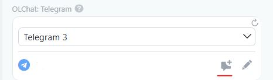

# OLChat: Telegram

## **Виджет «OLChat : Telegram»**

Виджет «OLChat: Telegram» обеспечивает быстрый доступ из карточки любой сущности CRM к выбору линии, созданию нового чата, переходу в уже созданный чат, а также позволяет отправить сообщение клиенту прямо из карточки CRM, не переходя в основное приложение.


По умолчанию виджет «OLChat:Telegram» при открытии карточки сущности отображается в скрытом виде с кнопкой «Обновить виджет».


Подробнее о том, как включить и показать виджет в карточке, ознакомьтесь в статье «Как включить и выключить виджеты».

Если вы хотите включить виджет «Чаты Telegram» для постоянного отображения, ознакомьтесь с разделом статьи [«Возможности»](https://tg.docs.olchat.io/vozmozhnosti/vidzhet-na-sait).

#### **Выбор линии и идентификатора клиента (номер телефона или username)**

Если к вашему порталу подключено несколько коннекторов линий Telegram, вы можете выбрать, с какой именно линии начать диалог с клиентом.

<figure><figcaption></figcaption></figure>

Если к сущности CRM прикреплено несколько контактов или компаний, в виджет подтянутся все доступные идентификаторы клиента (номера телефонов и/или username Telegram), по которым возможен диалог. В виджете отобразится не более 5 идентификаторов. Чтобы увидеть остальные, нажмите кнопку «Показать больше».

#### **Создание нового диалога и переход в уже созданный чат**&#x20;

Чтобы начать новый диалог с клиентом, выберите нужный идентификатор (номер телефона или username) и нажмите на иконку «Создать чат».

<figure><figcaption></figcaption></figure>

Если диалог с клиентом уже начат и чат был создан ранее, отобразится «Открыть чат». После нажатия на эту кнопку вы перейдёте в существующий чат с клиентом.

<figure><figcaption></figcaption></figure>


Через виджет вы можете открыть чат, находясь в любой сущности CRM, даже если он не привязан напрямую к текущей сущности.


#### **Отправка сообщений, файлов и голосовых из виджета**&#x20;

Виджет позволяет отправить сообщение клиенту прямо из карточки CRM без перехода в основное приложение. Для этого нажмите на иконку «Написать в чат». В открывшемся поле введите текст сообщения и нажмите кнопку отправки.

Кроме обычного текстового сообщения с помощью виджета также можно:

* Отправить файл.
* Записать и отправить голосовое сообщение.

<figure><figcaption></figcaption></figure>

#### **Создавать Дело в таймлайне**&#x20;

Если чекбокс «Создавать Дело в таймлайне» активирован, после отправки сообщения в таймлайне карточки создастся дело с информацией о содержании сообщения.

<figure><figcaption></figcaption></figure>

#### **Обновление информации в виджете**&#x20;

Информация в виджете обновляется автоматически при открытии карточки и не реже, чем раз в несколько минут (точная частота зависит от настроек коннектора).

#### **Что делать, если виджет не работает?**&#x20;

Необходимо проверить [«Права на приложение»](https://tg.docs.olchat.io/ustanovka-i-nastroika/nastroika-prav-dlya-raboty-s-prilozheniem-olchat).

#### **Что делать при ошибке «Нет данных авторизации от Битрикс24»?**&#x20;

Возможные причины:

1. У сотрудника нет прав на приложение — виджет не видит авторизацию. Проверьте [«Права на приложение»](https://tg.docs.olchat.io/ustanovka-i-nastroika/nastroika-prav-dlya-raboty-s-prilozheniem-olchat).
2. Временные проблемы с сервером авторизации Битрикс24. В этом случае нужно подождать решения от Битрикс24.
