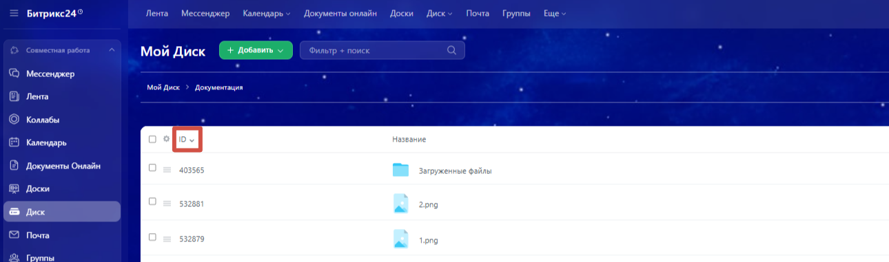
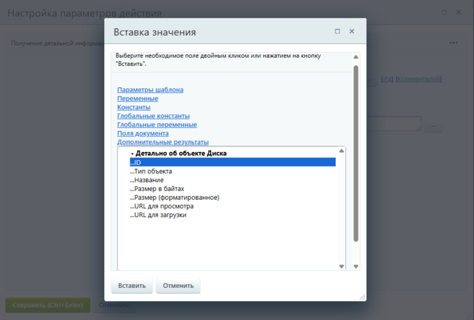
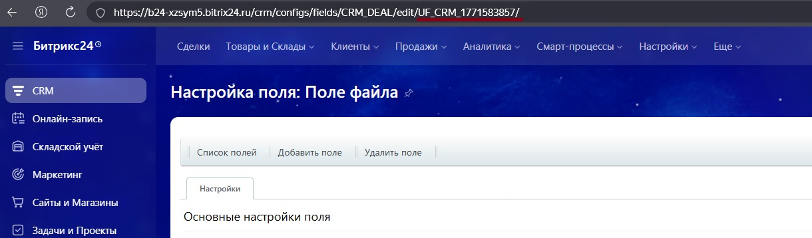

# Настройка отправки файла в зависимости от источника

При отправке файла с помощью активити или робота «\[OLChat Telegram] Отправить файл» и выборе типа источника файла доступны варианты «Прямая ссылка на файл», «Битрикс24.Диск (ID файла)» или «Файл из поля CRM».

В зависимости от выбранного типа источника необходимо указывать прямую ссылку на файл, его ID на Диске Битрикс24 или ID поля CRM, в котором хранится отправляемый файл.

## **Создание прямой ссылки на файл**

Прямая ссылка — это URL вида https://vashsite.ru/file.pdf, при переходе по которому Telegram сразу начинает скачивание файла без промежуточных страниц и авторизации.

Файл можно разместить:

* на собственном хостинге/сайте;&#x20;
* в сервисах, которые поддерживают генерацию прямых ссылок.


Через бизнес-процесс Битрикс24 невозможно получить прямую ссылку на скачивание файла из облачных хранилищ.

Битрикс24, Dropbox, Google Drive, Яндекс.Диск и другие облачные сервисы по умолчанию не создают прямые ссылки на скачивание, а создают публичные ссылки с промежуточной страницей, где нужно для загрузки нажать кнопку «Скачать».


## **Варианты создания прямых ссылок с помощью популярных сервисов**

* **Dropbox:** измените параметр в конце ссылки с ?dl=0 на ?dl=1 или ?raw=1. Пример: https://www.dropbox.com/s/mytoken/myfile.pdf?dl=1
* **Google Drive: с**делайте файл общедоступным («Доступ по ссылке»), затем преобразуйте ссылку вида https://drive.google.com/file/d/mytoken/view?usp=sharing в прямую: https://drive.google.com/uc?export=download\&id=mytoken

Аналогичный принцип работает для Яндекс.Диска и других облачных сервисов: публичную ссылку нужно изменить, чтобы получить прямой URL на скачивание без промежуточной страницы.

## **Указание ID отправляемого файла (Битрикс24.Диск)**

ID файла отображается в интерфейсе Диска Битрикс24:

1. Перейдите в раздел «Диск».
2. Найдите нужный файл.
3. В таблице или в деталях файла в столбце/поле «ID» будет указано число — это и есть нужный идентификатор.

<figure><figcaption></figcaption></figure>


Если столбец с ID отсутствует, нажмите на шестерёнку, чтобы выбрать, какие параметры должны отображаться в таблице файлов.


Также ID файла можно получить в бизнес-процессе, воспользовавшись активити «Детально об объекте Диска».

<figure><figcaption></figcaption></figure>

## **Указание ID поля, в котором находится отправляемый файл**

Чтобы узнать ID поля типа «Файл» в сущности CRM:

1. Перейдите в CRM → Настройки → Настройки CRM →Настройки форм и отчётов → Пользовательские поля.
2. Выберите сущность: Лид | Сделка | Контакт | Компания.
3. Откройте список полей → найдите нужное поле типа «Файл».
4. Откройте поле в режиме редактирования.
5. В адресной строке браузера увидите параметр вида FIELD\_ID=UF\_CRM\_XXXXXXXXXXXXX — скопируйте значение после =.

Вставьте этот ID в поле «Поле файла» робота/активити «\[OLChat: Telegram] Отправка файла».

<figure><figcaption></figcaption></figure>

## **Важно**

* Telegram позволяет отправлять файлы до 50 МБ (ограничение API бота). Файлы большего размера по умолчанию отправить не получится.
* При использовании короткой ссылки Битрикс24 убедитесь, что файл доступен без авторизации.
