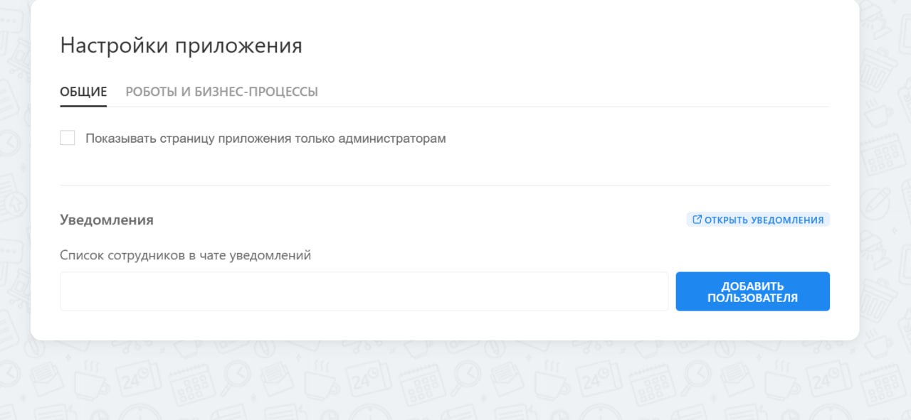

# Описание настроек приложения

Для перехода к панели приложения, в левом меню портала выберите приложение «OLChat Telegram»:

<figure><figcaption></figcaption></figure>

Для перехода в интерфейс настроек приложения для начала необходимо войти в панель приложения. Затем нажать на Иконку «**⚙**» **– Настройки.** Более подробно про [описание панели приложения здесь](https://tg.docs.olchat.io/ustanovka-i-nastroika/interfeisy-prilozheniya/opisanie-paneli-prilozheniya).&#x20;

Страница «Настройки приложения» содержит несколько вкладок с вложенными настройками:

<figure><figcaption></figcaption></figure>

### Общие

<figure><figcaption></figcaption></figure>

В разделе «ОБЩИЕ» содержатся следующие настройки:

1. Настройка "Показывать страницу приложения только администраторам" позволяет ограничить права доступа к странице приложения другим сотрудникам, кроме администраторов или сделать её доступной всем.&#x20;
2. В настройке «Уведомления» находится кнопка «ОТКРЫТЬ УВЕДОМЛЕНИЯ», ведущая в чат уведомлений, представлен список сотрудников в чате уведомлений и возможность добавить в этот чат сотрудников нажатием на кнопку «ДОБАВИТЬ ПОЛЬЗОВАТЕЛЯ».

### Роботы и бизнес-процессы

<figure><figcaption></figcaption></figure>

Раздел «РОБОТЫ И БИЗНЕС-ПРОЦЕССЫ» содержит список всех роботов и активити бизнес-процессов приложения OLChat: Telegram и кнопку для их переустановки. Подробнее в статье [roboty-i-aktiviti-deistviya-biznes-processov](../../roboty-i-aktiviti/roboty-i-aktiviti-deistviya-biznes-processov/ "mention")
