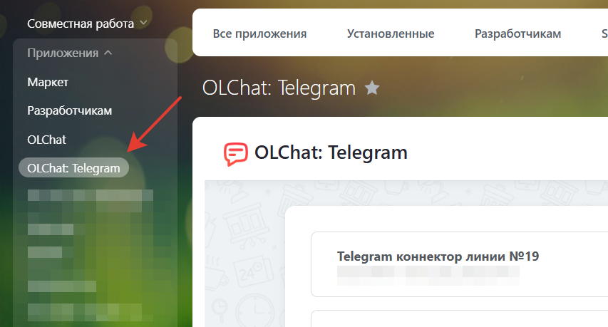

# Описание панели приложения

Панель приложения «Олчат: Telegram» является главным интерфейсом, содержащим набор кнопок и ссылок для управления настройками приложения, получения актуальной информации о подключенных линиях и статусах подключения.

Для перехода к настройкам панели приложения, в левом меню портала выберите приложение Олчат Telegram:

<figure><figcaption></figcaption></figure>

<figure><figcaption></figcaption></figure>

1. Кнопка «**+ Подключить линию**» — позволяет создавать и добавлять Открытые линии для подключения к ним коннекторов. Подробнее в статье [Настройка открытой линии](../nastroika-otkrytoi-linii.md).
2. Иконка «**⚙**» **– Настройки.** Переход к настройкам приложения. Подробнее в статье [opisanie-nastroek-prilozheniya.md](opisanie-nastroek-prilozheniya.md "mention").
3. Иконка «📃» **– Документация.** Ссылка на данную документацию.
4. Иконка «🗨️» **– Написать в поддержку.** Открывает чат поддержки пользователей приложения Олчат: Telegram в вашем Битрикс24.
5. **Название коннектора.** Настраивается в разделе Настройка коннектора. Подробнее в статье [opisanie-nastroek-konnektora.md](opisanie-nastroek-konnektora.md "mention").
6. **Номер и название** подключенной открытой линии. Название открытой линии настраивается в настройках отрытой линии. Подробнее в статье [nastroika-otkrytoi-linii.md](../nastroika-otkrytoi-linii.md "mention").
7. **ID** пользователя Telegram, который подключён к открытой линии в данный момент.
8. **Статус соединения** – показывает текущий статус соединения.
9. **Дата окончания** демонстрационного или оплаченного периода и количество оставшихся дней.
10. Значок «**•••**» **– Меню вызова настроек.**\
    \
    .png>) 
    1. **Оплатить.** Открывает окно для оплаты выбранного коннектора. Подробнее в статье [oplata-konnektora.md](../../stoimost-i-oplata-prilozheniya/oplata-konnektora.md "mention").
    2. **Настройки коннектора.** Открывает окно настроек коннектора. Подробнее в статье [Описание настроек  коннектора](opisanie-nastroek-konnektora.md).
    3. **Настройки линии.** Позволяет перейти в настройки открытой линии для данного коннектора. Подробнее в статье [nastroika-otkrytoi-linii.md](../nastroika-otkrytoi-linii.md "mention").
    4. **Настройки групп.** Открывает окно настроек для управления группами. Подробнее в статье [gruppovye-chaty.md](../../gruppovye-chaty/gruppovye-chaty.md "mention").
