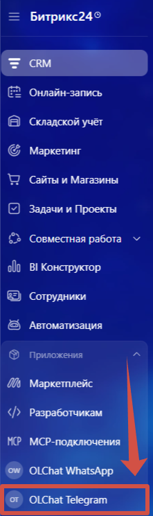
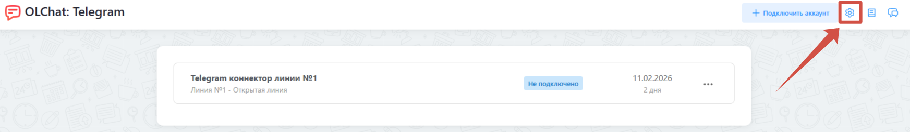
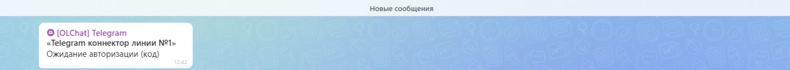
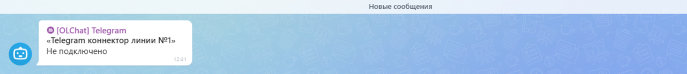

# Типы уведомлений приложения

Приложение Олчат Telegram создаёт на вашем портале Битрикс24 специальный чат, в который приходят уведомления. Здесь можно получить оперативную информацию об изменении статуса авторизации, подключения, оплаты, о блокировке линии. Также здесь будут подсказки для настройки приложения.

## Как открыть чат уведомлений и добавить в него сотрудников

Перейти в данный чат можно из настроек приложения. Для этого выполните следующие действия:

1. На портале Битрикс24 в меню слева откройте раздел «Приложения» и выберите Олчат Telegram.

2. На главной странице приложения нажмите на значок настроек ⚙ в правом верхнем углу.

<figure><figcaption></figcaption></figure>

3. В разделе «Общие» настроек нажмите на кнопку «Открыть уведомления», чтобы перейти в нужный чат.

<figure><figcaption></figcaption></figure>

4. Если необходимо предоставить доступ к чату сотрудникам, нажмите на кнопку «Добавить пользователя» и выберите из структуры компании нужных.

<figure><figcaption></figcaption></figure>

Рекомендуем добавить в этот чат администраторов портала, ответственных за интеграцию и техподдержку, — это позволит оперативно реагировать на проблемы с сессией Telegram или оплатой.

## Типы уведомлений

### Авторизация, подключение и отключение коннектора

* При выборе способа «Получение кода» при авторизации коннектора (ввод номера телефона → ожидание кода от Telegram):

<figure><figcaption></figcaption></figure>

* При выборе способа авторизации через QR-код:

<figure><figcaption></figcaption></figure>

* При успешной авторизации и подключении вы увидите «Подключено».

<figure><figcaption></figcaption></figure>

* При потере сессии или выходе из аккаунта придёт уведомление «Не подключено».

<figure><figcaption></figcaption></figure>

### Оплата коннектора

* Олчат Telegram предупредит об окончании тестового периода за 24 часа:

<figure><figcaption></figcaption></figure>

* Когда тестовый период завершится, придёт следующее уведомление:

<figure><figcaption></figcaption></figure>

 
