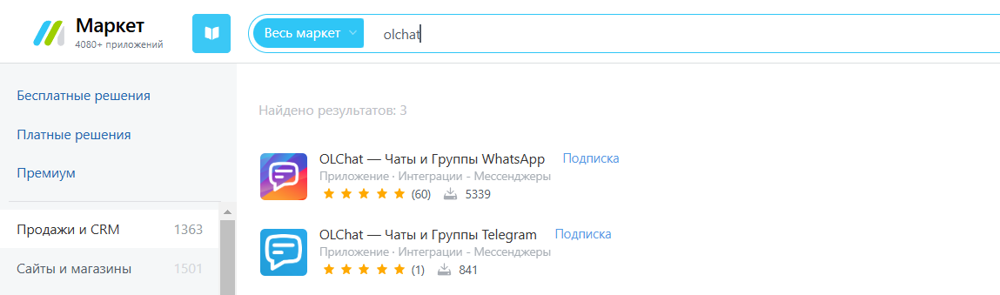

# Установка приложения


Установка приложения осуществляется через **Битрикс24 Маркетплейс**


Для установки приложения перейдите в «Маркет» вашего Битрикс24, введите в поиске «OLChat» и найдите приложение «OLChat — Чаты и Группы Telegram».

<figure><figcaption></figcaption></figure>

Выполните установку приложения, нажав на кнопку «УСТАНОВИТЬ»

<figure><figcaption></figcaption></figure>

После установки приложение OLChat: Telegram появится в меню слева.

<figure><figcaption></figcaption></figure>


Также вы можете установить приложение перейдя по ссылке на Маркет: [https://www.bitrix24.ru/apps/app/infocom.olchat\_tg/](https://www.bitrix24.ru/apps/app/infocom.olchat_tg/)

