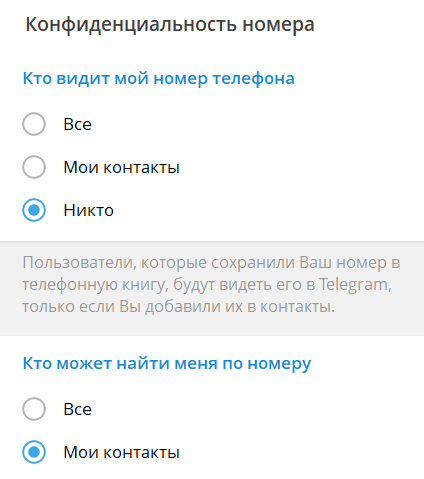
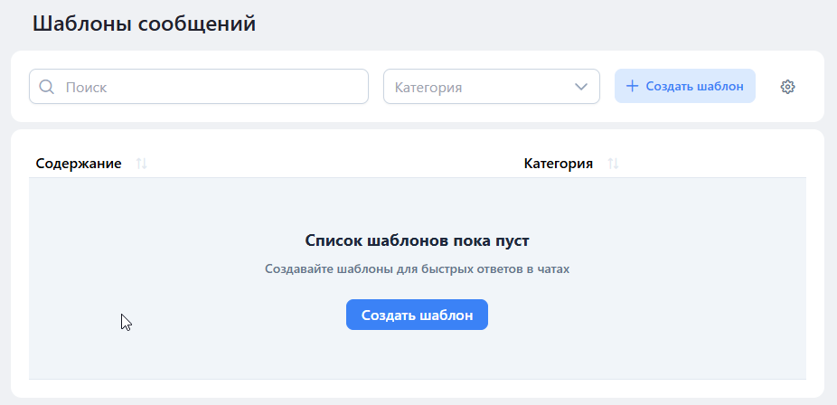

# Блокировка номера

## **Почему не получается написать всем по номеру телефона?**

Ниже опишем основные причины, почему такое может произойти.

### Настройки конфиденциальности

В отличие от WhatsApp, в Telegram номер телефона **не является обязательным** публичным идентификатором для всех пользователей. Это важный момент, который нужно учитывать при попытках написать клиенту по номеру. &#x20;

В Telegram есть система настроек конфиденциальности, которая позволяет пользователю контролировать кто видит его номер телефона. По логике Telegram, можно сделать чтобы номер был виден всем пользователям Telegram, моим контактам или никому.  По умолчанию при регистрации номера в Telegram ставится «Мои контакты». \
\
\
Разберём, при каких настройках написать по номеру не получится. &#x20;

* «Кто видит мой номер телефона»: **никто.**
* «Кто может найти меня по номеру»: **мои контакты.**

При таких настройках отправить сообщение пользователю по номеру не выйдет, так как Telegram не раскрывает номер.

Поэтому наличие номера телефона не гарантирует, что вы сможете написать пользователю по этому номеру через интеграцию. Даже если номер есть в CRM, всё зависит от настроек приватности самого пользователя в Telegram.


Рекомендуем обязательно сохранить номер телефона пользователя себе в телефонную книгу. Лучше всего синхронизировать контакты через телефонную книгу (и/или другим привычным способом обновления контактов), без «заливки базы» рывком. Если нужно добавлять вручную, то делайте это маленькими порциями, без серий «пакетом». Если после добавления контактов появляются ограничения/ошибки — остановитесь, дайте аккаунту «остыть» 24-48 часов и снизьте темп.


### Лимиты

Вы узнали, что у пользователя номер виден всем, но написать все равно не получается? Помимо настроек конфиденциальности, существует также ограничения Telegram на отправку сообщений новым контактам. Telegram специально встроил механизмы защиты от спама, которые ограничивают возможность писать первыми незнакомым людям.

#### Возможные причины ограничения

* вы часто пишете людям, которые не добавили ваш номер в свои контакты;
* вы отправляете много сообщений за короткое время;
* на ваш аккаунт жалуются пользователи.

В связи с этим может появиться временное ограничение на возможность «писать первым» новым контактам. При этом вы можете отвечать тем, кто вам написал первым, вы можете писать людям, которые уже взаимно добавили вас в контакты.

Обычно такие ограничения снимаются через некоторое время, 24–48 часов при отсутствии дальнейших подозрительных действий. Но в зависимости от ситуации (аккаунт новый, много жалоб на спам, частые попытки написать многим незнакомцам) Telegram может продлевать ограничения на несколько дней или дольше.

#### Что можно сделать в такой ситуации?&#x20;

Попробуйте, написать изначально с телефона (через мобильное приложение Telegram) — поскольку ограничения действуют чаще на уровне API (интрегации), но это не даёт 100% гарантии.

### Первый контакт

Вы создаете контакт с номером телефона и сразу хотите написать, ранее вы не писали данному клиенту из CRM, в таком случае данные о контакте могут не сразу подгрузиться. Поэтому, когда вы пишете клиенту впервые, подождите около 5 минут — за это время информация может прогрузиться и появится возможность отправить сообщения, если нет других ограничений.

### Блокировка аккаунта

Для предотвращения фишинга, спама и других видов злоупотреблений и нарушений Условий обслуживания Telegram ваш аккаунт может быть ограничен от контактов с незнакомыми людьми — временно или навсегда.

Чтобы отправить апелляцию, узнать заблокирован ли номер, используя **@Spambot**.

Также вы можете ознакомиться с часто задаваемыми вопросами о [спаме](https://telegram.org/faq_spam?setln=ru), прочитать [условия предоставления услуг ](https://telegram.org/tos/eu)и ознакомится с политикой [конфиденциальности](https://telegram.org/privacy/eu) на официальном сайте  документации Telegram.&#x20;


Важно! Новый аккаунт надо «прогревать» перед подключением. Первые несколько дней используйте аккаунт в обычном режиме (личные диалоги, подписка на каналы, реакции, комментарии). Избегайте резких всплесков: массового добавления контактов, массовых первых сообщений, одинаковых шаблонов. Подключайте Олчат, когда аккаунт уже выглядит «живым» (есть переписка, нормальная активность).


### Нет аккаунта

При переходе к отправке сообщения  из карточки напротив имени контакта/лида отображается цветная точка-индикатор:

* **Зелёная точка** — аккаунт Telegram найден, можно отправлять сообщения.
* **Серая точка** — номер телефона указан, но аккаунт Telegram по данному номеру не обнаружен.\
  Рекомендуется попробовать отправить сообщение по имени пользователя (username). Если пользователь скрыл свой номер телефона, отправка сообщения по номеру в любом случае завершится ошибкой, тогда как по известному имени сообщение может быть успешно доставлено.

При попытке отправить сообщение при серой точке система выдаёт стандартную ошибку:

<figure><figcaption></figcaption></figure>
