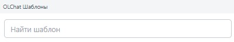
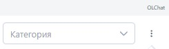
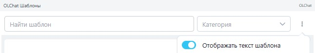
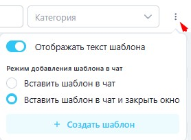

# Шаблоны сообщений

Если вы регулярно отправляете однотипные сообщения клиентам в Telegram, воспользуйтесь шаблонами сообщений Олчат. Эти шаблоны универсальны и работают для каналов Олчат, включая Telegram.

Отправка шаблонов сообщений входит в базовые возможности приложения Олчат и доступна всем пользователям.

## **Настройка и создание шаблонов**&#x20;

Шаблоны создаются и редактируются в разделе Олчат (не в отдельном приложении Олчат: Telegram). Подробная инструкция по созданию, редактированию, категориям и переменным доступна здесь: [https://docs.olchat.io/capabilities/shablony-soobshenii](https://docs.olchat.io/capabilities/shablony-soobshenii).

Для работы с шаблонами сообщений в Telegram установите следующие приложения:

* **Олчат**.
* **Олчат: Telegram** (основное приложение для подключения чатов и групп Telegram к Открытым линиям).
* **Олчат — Чаты и Группы Telegram** (приложение, которое добавляет функционал шаблонов сообщений, быстрых ответов и связанных возможностей).

#### **Кратко о настройке шаблонов**

1. Перейдите в приложение Олчат в левом меню портала Битрикс24.

<figure><figcaption></figcaption></figure>

1. Выберите пункт меню **«Настройки шаблонов»**.

<figure><figcaption></figcaption></figure>

1. Нажмите **«+ Создать шаблон»**.
2. Укажите **Название шаблона** и **Текст шаблона**.
   * Для подстановки переменных из CRM (системы управления взаимоотношениями с клиентами) нажмите значок **{ }** → выберите поле (Сделка, Контакт, Компания, Лид и др.).
   * При отправке значения в **\{{название\_поля\}}** заменяются автоматически.
3. На следующем шаге (опционально) присвойте **категорию** и укажите **права доступа** (если пусто — доступ всем сотрудникам).
4. Нажмите **«Сохранить»**.

Шаблоны можно сортировать, искать, фильтровать по категориям, редактировать или удалять в общем списке.

#### **Управление категориями**&#x20;

В разделе **«Настройки шаблонов»** нажмите значок шестерёнки **⚙️** → **«Создать категорию»** → введите название → **«Добавить»**. Категории помогают быстро находить нужные шаблоны при работе в чатах.

#### **Отправка шаблонного сообщения из чата Открытой линии**.

1. Откройте чат с клиентом в Открытой линии (Telegram-канал).
2.  В поле ввода сообщения нажмите значок «Редактирование и выбор шаблонов».

    <figure><figcaption></figcaption></figure>
3. В открывшемся окне выберите нужный шаблон из списка.
   * Текст шаблона автоматически вставится в поле ввода.
   * Переменные подставятся из связанных полей CRM (если чат привязан к сущности: сделка, лид, контакт и т.д.).
4. При необходимости отредактируйте текст вручную.
5. Нажмите **«Отправить»**.

#### **Дополнительные опции в окне выбора шаблонов (в чате):**

* Строка поиска по ключевым словам в названии или тексте.

<figure><figcaption></figcaption></figure>

* Фильтр по категориям.

<figure><figcaption></figcaption></figure>

* Переключатель «Отображать текст шаблона» — включает/выключает показ полного текста в списке (для компактного вида оставьте только названия).

<figure><figcaption></figcaption></figure>

* Режим вставки:
  * «Вставить шаблон в чат» — окно остаётся открытым (удобно для отправки нескольких шаблонов подряд).
  * «Вставить шаблон в чат и закрыть окно» — автоматическое закрытие после вставки.
* Кнопка **«+ Создать шаблон»** — позволяет добавить новый шаблон прямо из чата, без перехода в настройки.

<figure><figcaption></figcaption></figure>

## **Отправка шаблонов из карточки CRM (приложение** Олчат **в карточке)**

Отправка шаблонов напрямую из поля «Шаблоны» в карточке сущности (лид, контакт, сделка, компания) для каналов Telegram недоступна.&#x20;


Для оперативной работы с клиентами в Telegram используйте шаблоны именно через чат Открытой линии — это наиболее удобный и быстрый способ. Если нужно отправить шаблон из карточки — пока переключайтесь в чат Открытой линии или копируйте текст шаблона вручную.

