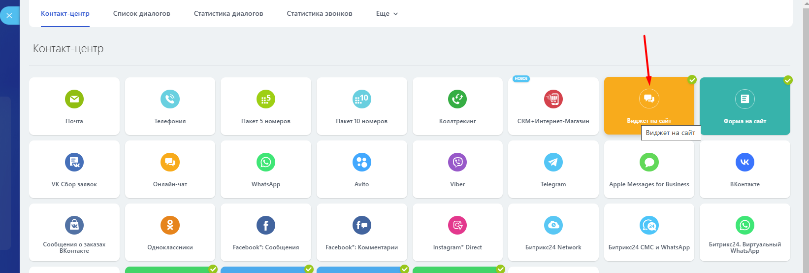

# Виджет на сайт

Для добавления виджета Telegram на ваш сайт в левом меню портала войдите в приложение **OLChat: Telegram —** ••• **— Настройки коннектора — Настройки — Настройка виджета на сайт.**

Укажите текст название виджета в соответствующем поле. Нажмите на кнопку «ОБНОВИТЬ ВИДЖЕТ».

Также вы можете скопировать ссылку на чат в Telegram из поля, в котором прописана ссылка, нажав на иконку «📄».

<figure><figcaption></figcaption></figure>

Далее перейдите в **Контакт-центр — Виджет на сайт**.

<figure><figcaption></figcaption></figure>

Включите канал в настройках виджета:

<figure><figcaption></figcaption></figure>

Если у вас уже существует и настроен виджет с каким-то набором подключенных к нему каналов, вы можете подключить к нему канал из другой линии. Это может пригодиться в случае, если для приложения OLChat: Telegram вы использовали отдельную открытую линию со своим сценарием обработки и распределения входящих сообщений от клиентов.

Для добавления канала Telegram из открытой линии подключенной к приложению OLChat: Telegram, в настройках виджета нажмите ссылку «добавить открытую линию».

<figure><figcaption></figcaption></figure>

Выберите нужную открытую линию. Включите канал в настройках виджета.

<figure><figcaption></figcaption></figure>


После установки виджет может появиться на сайте не сразу, т.к. он кэшируется на стороне Битрикс24. Чаще всего такое случается на коробочных версиях Битрикс24. Обновляться виджет может в течение 15-60 минут.

Для ускорения обновления данных в виджете рекомендуем выключать и включать виджет. Тогда кэш виджета обновляется быстрее и применяются новые настройки.


Для выключения и включения виджета перейдите в раздел **CRM – Интеграции – Виджет на сайт**.

Найдите нужный виджет и напротив него нажмите на кнопку «ВЫКЛЮЧИТЬ» а затем «ВКЛЮЧИТЬ».

<figure><figcaption></figcaption></figure>

<figure><figcaption></figcaption></figure>

Установленный виджет отобразится на сайте:

<figure><figcaption></figcaption></figure>


Настройка виджета для сайта в Битрикс24\
[https://helpdesk.bitrix24.ru/open/6986667/](https://helpdesk.bitrix24.ru/open/6986667/)

